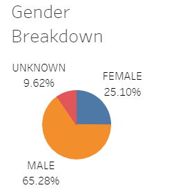
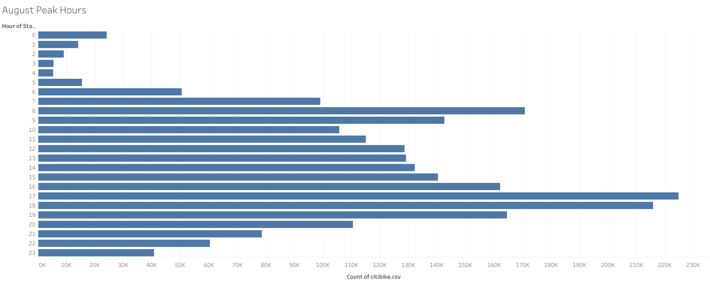
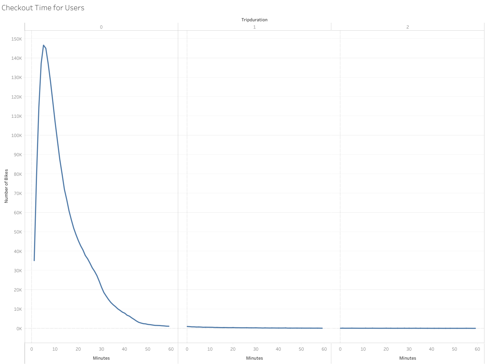
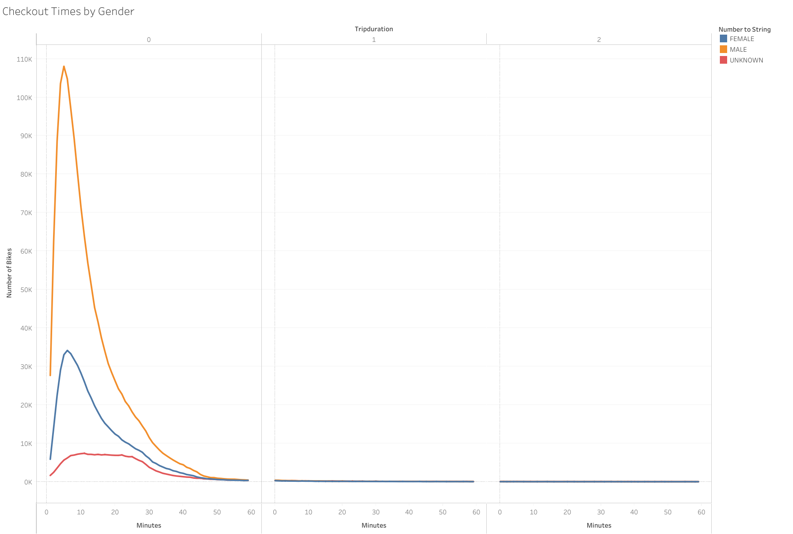
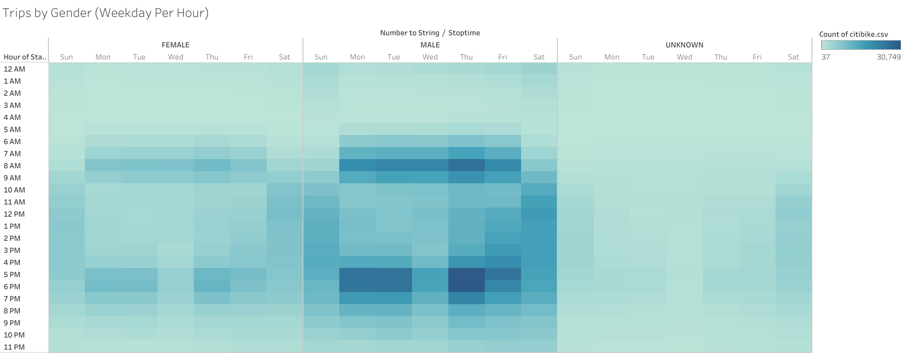
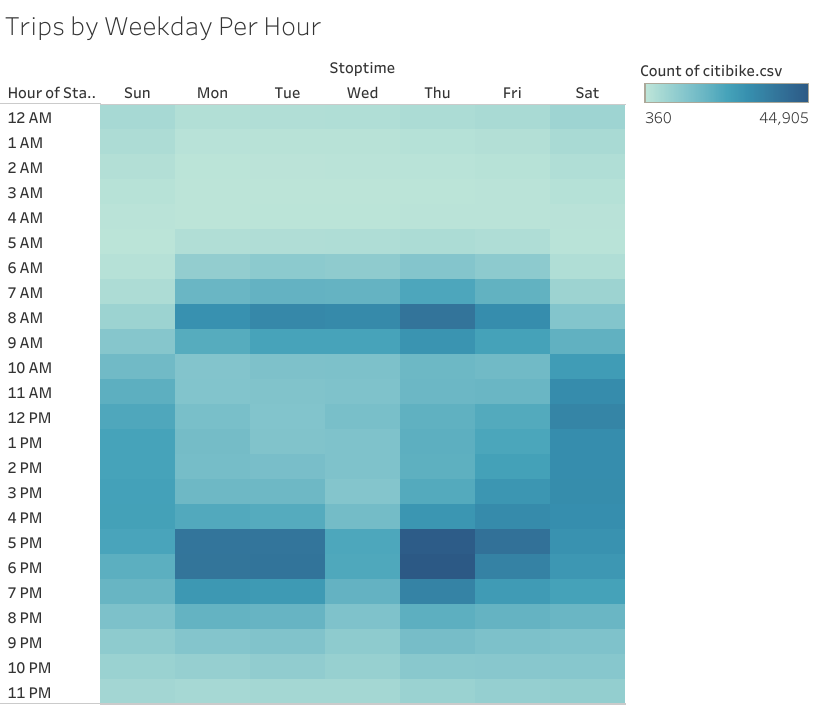
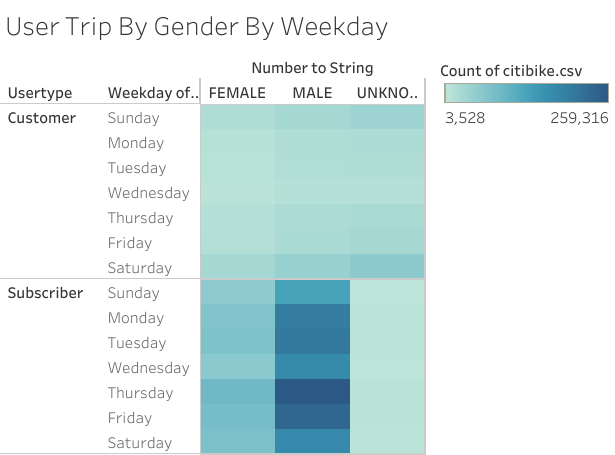

# Bikesharing

[link to dashboard](https://public.tableau.com/views/Bikesharing_Challenge_16332803101940/NumberofTrips?:language=en-US&publish=yes&:display_count=n&:origin=viz_share_link)

### Overview
This is an analysis of the New York City bike sharing program. The analysis will be used to help investors decide if a bike sharing program could work in Des Moines. 

### Results

Below are the results of the New York bikesharing program form the month of August:

As we can see in the chart below, Males made up a majority of the riders for the month of August. 65% of the riders are males, compared to only 25% of the riders were female.

Peak hours in August were 5-6pm and 8am, this is in line with the typical commute hours for individuals working 9-5 jobs. The chart will be helpful to determine when maintenance can occur. 

### Summary
